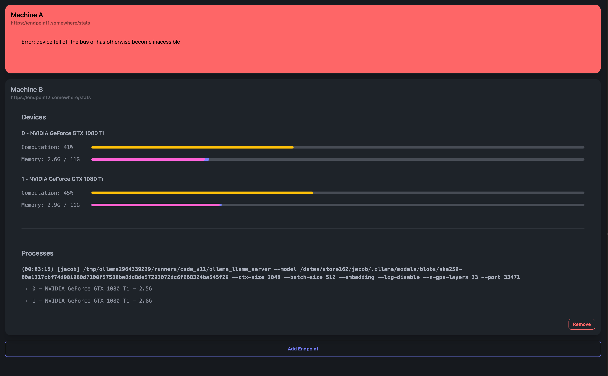

# NVML Server Dashboard

The dashboard frontend for the [NVML Server](https://github.com/JacobLinCool/nvml-server).

To see the real-time GPU status, you need to run the NVML Server on the target machine, and enter the endpoint in the dashboard.

